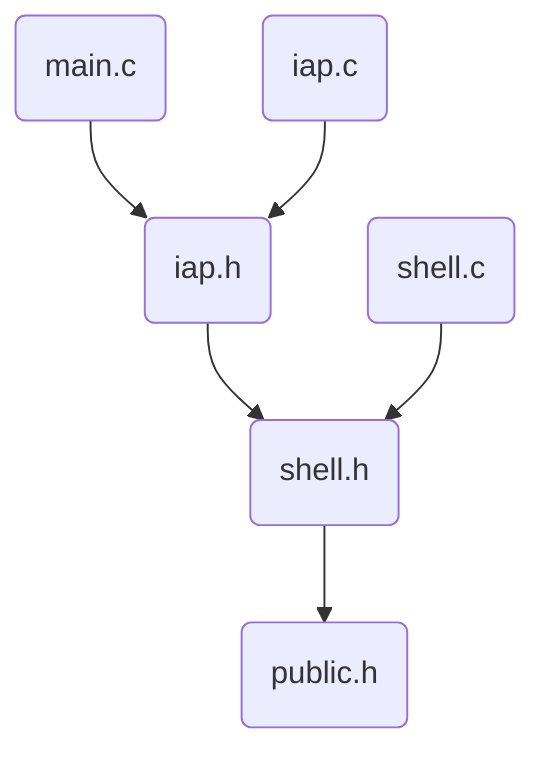

# stm32 iap

> wvv 2018-02-19

## CubeMX Config

### Pinout配置

1. SYS，Debug，Serial Wire
2. USART2, Mode, Asynchronous (USART1和USB_OTG_FS冲突)
3. RCC, High Speed Clock, Crystal
4. %SPI1, Mode,  Full-Duplex Master
5. *USB_OTG_FS, Mode, Device_Only
6. *USB_DEVICE, Class For FS IP, Communication Device Class

%为lcd等扩展输出，不必须

*为VCP输入输出，不必须

### Clock Configuration配置

1. 左侧Input Frequency (外部晶振) 按实际情况输入，比如8MHz
2. 输入切换到HSE, System Clock Mux选择PLLCLK
3. 然后可以点击工具栏对号按钮（自动配置），实现自动配置

### Project Settings

1. 设置Project Name

2. Toolchain / IDE, MDK-ARM V5

3. Code Generator,  Check Generate peripheral ...

### Generator Code

## IAP系统分析

### 文件结构

### IAP启动流程

1. 设置IAP工程IROM初始地址，大小
2. 规划好IAP，IAP CONFIG，APP1，APP2, flash区域划分，两个APP目的是为了防止升级时出现异常导致APP区数据丢失，造成启动失败，写APP时选择非当前APP区写，校验完成后切换启动APP即可。
3. 启动时从IAP CONFIG区加载配置，读取启动参数，启动参数主要包含APP程序起始地址
4. 检测是否需要升级，需要进入升级模式，包含SHELL模式
5. 一段时间无操作，自动切换到APP区域运行
6. 跳转核心代码如下：
   1. 判断APP启动地址是否为栈指针范围，不是说明无APP，给出错误信息
   2. 函数指针指向APP_ADDR+4，此处为复位中断地址
   3. 系统初始化
   4. 设置系统栈为APP_ADDR
   5. 运行函数指针，程序将自动复位，然后进入用户main函数执行
   6. 注意：用户APP代码需要在系统初始化后重新映射中断服务表到APP_ADDR，否则用户APP会运行异常
   7. 注意：用户APP工程还需要设置flash起始地址和大小，根据flash规划来安排

### IAP升级流程

1. 默认后台自动升级（不经用户确认，用于无法交互嵌入式设备），通过各种通信方式，比对版本，flash区解锁，下载新版到flash区，校验，修改启动配置参数，flash上锁，软重启
2. 用户主动进入IAP shell，通过物理按键，或者启动很短间隔内通信触发。

