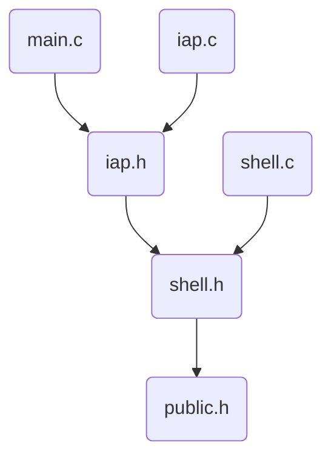

# stm32 iap

> wvv 2018-02-19

## CubeMX Config

### Pinout配置

1. SYS，Debug，Serial Wire
2. USART2, Mode, Asynchronous (USART1和USB_OTG_FS冲突)
3. RCC, High Speed Clock, Crystal
4. %SPI1, Mode,  Full-Duplex Master
5. *USB_OTG_FS, Mode, Device_Only
6. *USB_DEVICE, Class For FS IP, Communication Device Class

%为lcd等扩展输出，不必须

*为VCP输入输出，不必须

### Clock Configuration配置

1. 左侧Input Frequency (外部晶振) 按实际情况输入，比如8MHz
2. 输入切换到HSE, System Clock Mux选择PLLCLK
3. 然后可以点击工具栏对号按钮（自动配置），实现自动配置

### Project Settings

1. 设置Project Name

2. Toolchain / IDE, MDK-ARM V5

3. Code Generator,  Check Generate peripheral ...

### Generator Code

## Source Code

### File Structure

